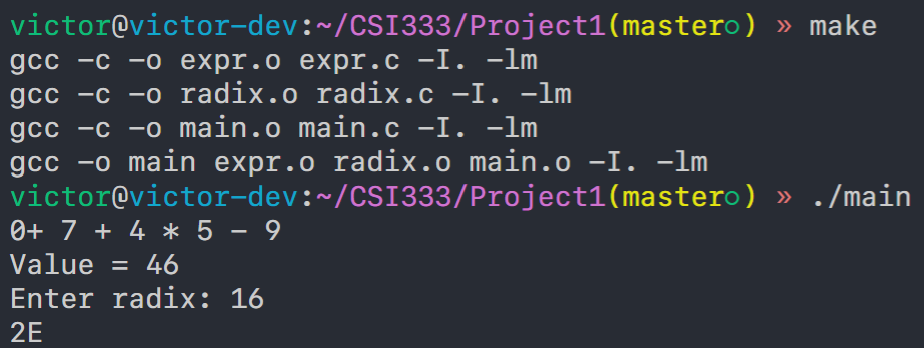

# Project 1

The project aims to implement a toy expression evaluator and radix converter.

The structure of my project:
- `main.c`: The entrypoint of this program
- `expr.h`: The header file of expression evaluator, which defines the functions
- `expr.c`: The source file of expression evaluator, which implements the evaluation
- `radix.h`: The header file of radix converter, which defines some error constant and functions
- `radix.h`: The source file of radix converter, which implements the conversion and buffer length calculation
- `Makefile`: Project definition of GNU make

Running screenshot:
