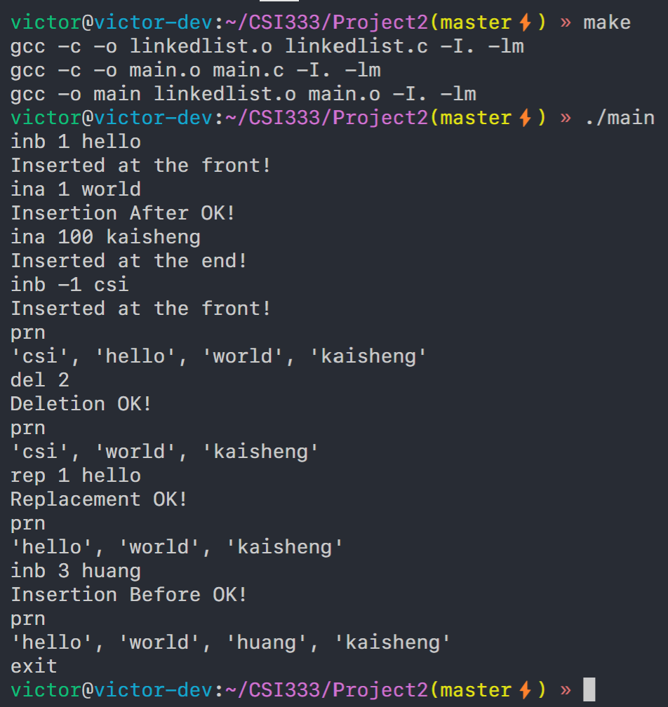

# Project 2

The project aims to implement a toy deduplicated and indexed text linked list.

The structure of my project:
- `main.c`: The entrypoint of this program
- `linkedlist.h`: The header file of linked list, which defines some error constant and functions
- `linkedlist.h`: The source file of linked list, which implements insertion on two sides, replacement, printing and deletion
- `Makefile`: Project definition of GNU make

Running screenshot:
