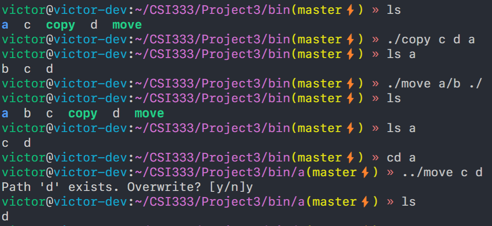

# Project 3

The project aims to implement a copy program and move program.

The structure of my project:
- `copy.c`: copy function implementation
- `copy.h`: copy function header
- `move.c`: move function implementation
- `move.h`: move function header
- `util.c`: utilities implementation
- `util.h`: utilities header
- `main.c`: The entrypoint of this program

Running screenshot:
